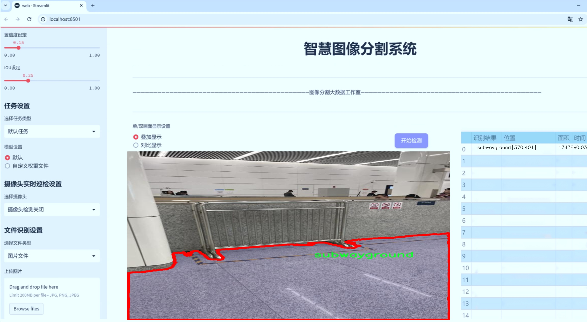
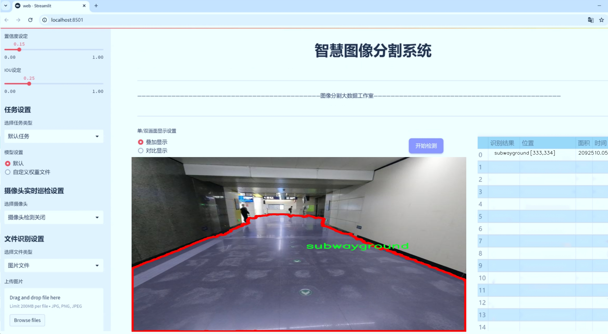
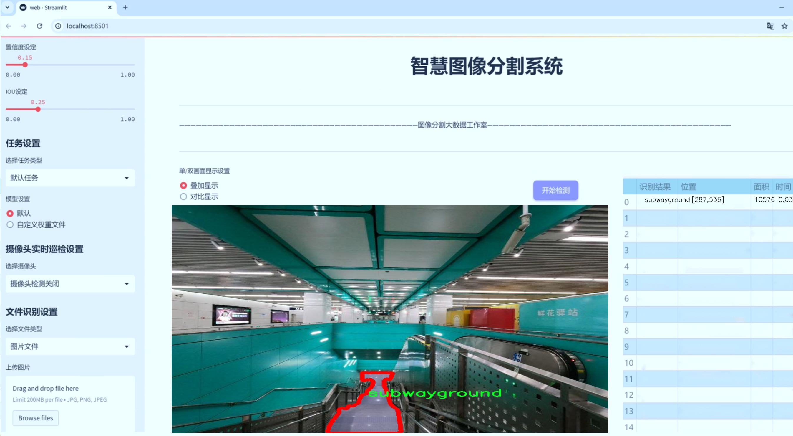
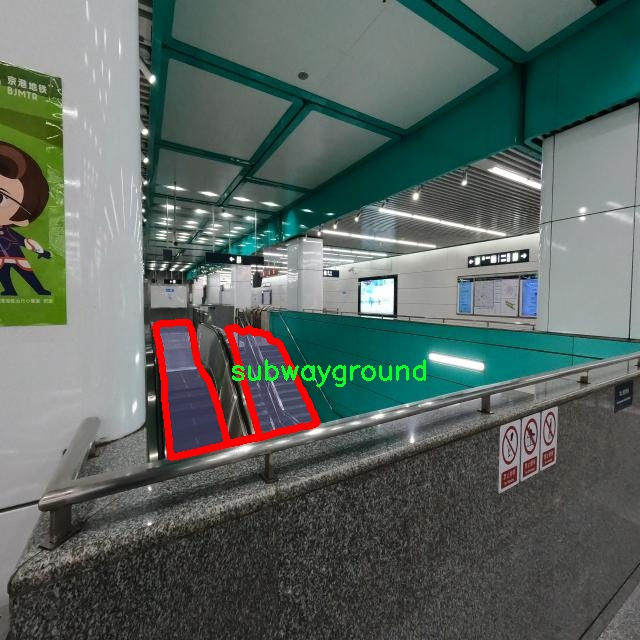
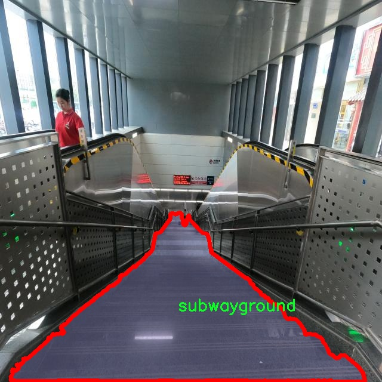
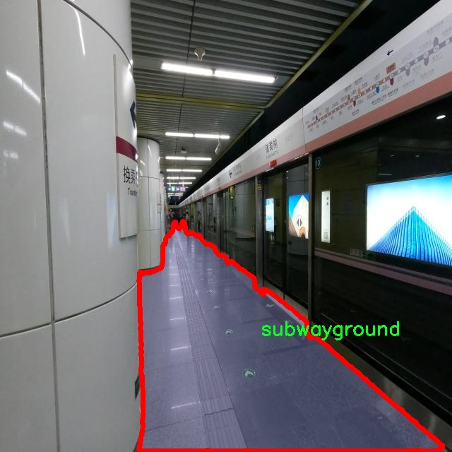
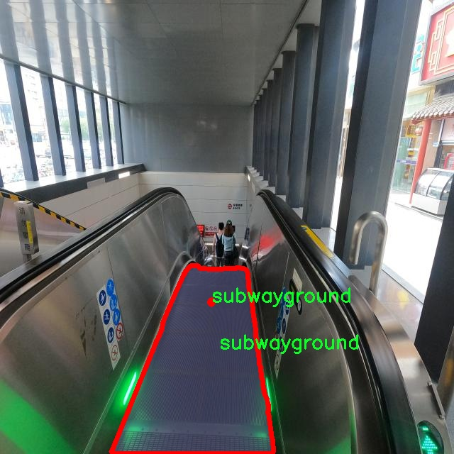
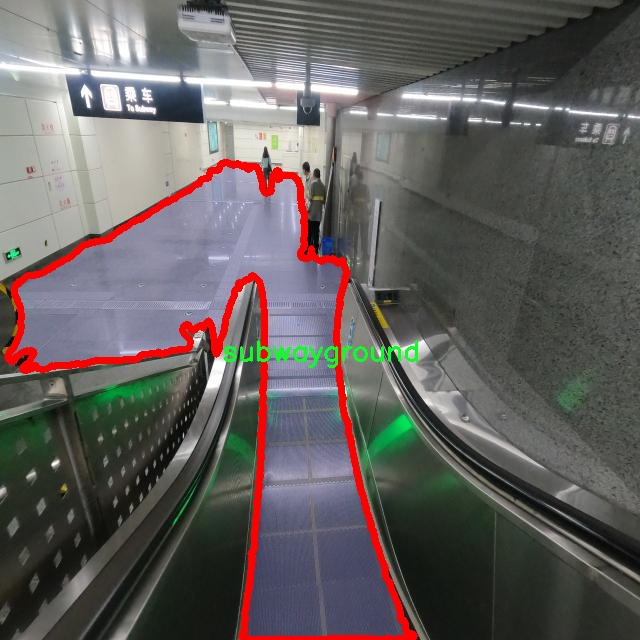

# 地铁地面类型分类图像分割系统： yolov8-seg-C2f-CloAtt

### 1.研究背景与意义

[参考博客](https://gitee.com/YOLOv8_YOLOv11_Segmentation_Studio/projects)

[博客来源](https://kdocs.cn/l/cszuIiCKVNis)

研究背景与意义

随着城市化进程的加快，地铁作为现代城市交通的重要组成部分，其建设与运营日益受到重视。在地铁系统中，地面类型的分类与识别对于安全运营、维护管理以及乘客体验等方面具有重要意义。地铁地面类型的多样性和复杂性使得传统的人工识别方法面临诸多挑战，因此，借助先进的计算机视觉技术进行自动化的地面类型分类与图像分割显得尤为必要。

近年来，深度学习技术的迅猛发展为图像处理领域带来了革命性的变化，尤其是在目标检测和图像分割任务中，YOLO（You Only Look Once）系列模型因其高效性和准确性受到广泛关注。YOLOv8作为该系列的最新版本，结合了更为先进的网络结构和优化算法，能够在保持实时性和高精度的同时，处理复杂的图像分割任务。然而，针对特定应用场景的YOLOv8模型仍需进行改进，以更好地适应地铁地面类型的分类需求。

本研究旨在基于改进的YOLOv8模型，构建一个高效的地铁地面类型分类图像分割系统。我们将利用一个包含4400张图像的专用数据集，该数据集专注于地铁地面类型的实例分割，涵盖了单一类别“subwayground”。通过对该数据集的深入分析与处理，我们将为模型的训练和测试提供坚实的基础。数据集的规模和类别设置使得模型能够在特定的地面类型上进行深入学习，从而提高分类和分割的准确性。

此外，地铁地面类型的准确识别不仅有助于提升地铁运营的安全性，还能为地铁的维护和管理提供数据支持。例如，通过实时监测地面状况，运营方可以及时发现潜在的安全隐患，采取相应的维护措施，减少事故发生的概率。同时，准确的地面类型分类也能优化乘客的出行体验，提升地铁服务的整体质量。

在技术层面，本研究将通过对YOLOv8模型的改进，探索更为高效的特征提取和图像分割方法，以应对地铁地面类型的复杂性。这一过程不仅涉及模型架构的优化，还包括数据增强、损失函数的调整以及训练策略的改进等方面。通过这些技术手段，我们期望能够显著提升模型在地铁地面类型分类与分割任务中的表现。

综上所述，本研究的开展不仅具有重要的理论意义，推动了计算机视觉技术在地铁地面类型识别领域的应用进程，同时也具备实际应用价值，为地铁运营管理提供科学依据，促进城市交通的智能化发展。通过对改进YOLOv8模型的深入研究，我们希望能够为地铁系统的安全与效率提升贡献一份力量。

### 2.图片演示







注意：本项目提供完整的训练源码数据集和训练教程,由于此博客编辑较早,暂不提供权重文件（best.pt）,需要按照6.训练教程进行训练后实现上图效果。

### 3.视频演示

[3.1 视频演示](https://www.bilibili.com/video/BV1BamdYLEtb/)

### 4.数据集信息

##### 4.1 数据集类别数＆类别名

nc: 1
names: ['subwayground']


##### 4.2 数据集信息简介

数据集信息展示

在本研究中，我们使用了名为“subway”的数据集，旨在训练和改进YOLOv8-seg模型，以实现对地铁地面类型的分类和图像分割。该数据集专注于地铁环境中的地面类型，提供了丰富的图像数据，能够有效支持模型的训练和评估。数据集的类别数量为1，具体类别为“subwayground”，这意味着我们将重点关注地铁站内的地面类型特征，以便在实际应用中实现精准的图像分割和分类。

“subway”数据集的设计考虑到了地铁环境的多样性和复杂性。地铁站内的地面类型可能包括瓷砖、混凝土、地毯等多种材料，而这些材料在视觉上具有不同的纹理、颜色和反射特性。通过对这些地面类型的准确识别，模型能够为地铁站的安全管理、维护和改进提供数据支持。例如，在进行地面清洁和维护时，能够根据不同的地面材料制定相应的处理方案，从而提高工作效率和安全性。

在数据集的构建过程中，研究团队对地铁站内的不同区域进行了详细的拍摄，确保数据的多样性和代表性。图像的采集时间、光照条件和拍摄角度都经过精心设计，以捕捉地面类型在不同环境下的表现。这种多样化的图像数据将有助于模型学习到更为丰富的特征，从而提高其在实际应用中的泛化能力。

此外，数据集中的图像经过了精确的标注，确保每一张图像中地面类型的区域都得到了准确的分割。这一过程不仅需要专业的标注人员，还需要对地面类型有深入了解的专家参与，以确保标注的准确性和一致性。通过高质量的标注，模型能够在训练过程中学习到更为细致的特征，从而在推理阶段实现更高的准确率。

在模型训练过程中，我们将采用数据增强技术，以进一步提升模型的鲁棒性。通过对原始图像进行旋转、缩放、裁剪和颜色调整等操作，生成多样化的训练样本，从而帮助模型更好地适应不同的环境和条件。这一策略不仅能够增加训练数据的有效性，还能有效防止模型的过拟合现象。

综上所述，“subway”数据集为改进YOLOv8-seg的地铁地面类型分类图像分割系统提供了坚实的基础。通过对地面类型的深入研究和高质量的数据支持，我们期望能够实现更为精准的地面类型识别和分割，为地铁站的管理和维护提供有力的技术支持。随着研究的深入，我们相信这一数据集将为地铁环境的智能化管理带来新的机遇和挑战。











### 5.项目依赖环境部署教程（零基础手把手教学）

[5.1 环境部署教程链接（零基础手把手教学）](https://www.bilibili.com/video/BV1jG4Ve4E9t/?vd_source=bc9aec86d164b67a7004b996143742dc)


[5.2 安装Python虚拟环境创建和依赖库安装视频教程链接（零基础手把手教学）](https://www.bilibili.com/video/BV1nA4VeYEze/?vd_source=bc9aec86d164b67a7004b996143742dc)

### 6.手把手YOLOV8-seg训练视频教程（零基础手把手教学）

[6.1 手把手YOLOV8-seg训练视频教程（零基础小白有手就能学会）](https://www.bilibili.com/video/BV1cA4VeYETe/?vd_source=bc9aec86d164b67a7004b996143742dc)


按照上面的训练视频教程链接加载项目提供的数据集，运行train.py即可开始训练



     Epoch   gpu_mem       box       obj       cls    labels  img_size
     1/200     0G   0.01576   0.01955  0.007536        22      1280: 100%|██████████| 849/849 [14:42<00:00,  1.04s/it]
               Class     Images     Labels          P          R     mAP@.5 mAP@.5:.95: 100%|██████████| 213/213 [01:14<00:00,  2.87it/s]
                 all       3395      17314      0.994      0.957      0.0957      0.0843

     Epoch   gpu_mem       box       obj       cls    labels  img_size
     2/200     0G   0.01578   0.01923  0.007006        22      1280: 100%|██████████| 849/849 [14:44<00:00,  1.04s/it]
               Class     Images     Labels          P          R     mAP@.5 mAP@.5:.95: 100%|██████████| 213/213 [01:12<00:00,  2.95it/s]
                 all       3395      17314      0.996      0.956      0.0957      0.0845

     Epoch   gpu_mem       box       obj       cls    labels  img_size
     3/200     0G   0.01561    0.0191  0.006895        27      1280: 100%|██████████| 849/849 [10:56<00:00,  1.29it/s]
               Class     Images     Labels          P          R     mAP@.5 mAP@.5:.95: 100%|███████   | 187/213 [00:52<00:00,  4.04it/s]
                 all       3395      17314      0.996      0.957      0.0957      0.0845


### 7.50+种全套YOLOV8-seg创新点加载调参实验视频教程（一键加载写好的改进模型的配置文件）

[7.1 50+种全套YOLOV8-seg创新点加载调参实验视频教程（一键加载写好的改进模型的配置文件）](https://www.bilibili.com/video/BV1Hw4VePEXv/?vd_source=bc9aec86d164b67a7004b996143742dc)

### YOLOV8-seg算法简介

原始YOLOv8-seg算法原理

YOLOv8-seg算法是YOLO系列目标检测模型的最新版本，它不仅继承了YOLO系列一贯的高效性和准确性，还在此基础上引入了图像分割的能力，使得模型在处理复杂场景时更加灵活和高效。YOLOv8-seg的设计理念围绕着“快速、准确和易于使用”展开，旨在为目标检测、图像分割和图像分类等任务提供一个强大的解决方案。

YOLOv8-seg的网络结构主要由三个部分组成：Backbone、Neck和Head。Backbone负责特征提取，Neck则用于特征增强，而Head则是最终进行目标检测和分割的部分。相较于前代模型，YOLOv8-seg在特征提取方面采用了CSPDarknet结构，这一结构通过将网络分为两个部分并引入多个残差块，极大地提升了特征提取的能力。具体而言，YOLOv8-seg用C2f模块替换了YOLOv5中的C3模块。C2f模块的设计使得输入特征图被分为两个分支，经过卷积层进行降维后再进行融合，从而形成更高维度的特征图。这种设计不仅提升了模型的梯度流信息，还有效增强了特征的表达能力。

在特征增强方面，YOLOv8-seg引入了快速空间金字塔池化（SPPF）结构，旨在提取不同尺度的特征。SPPF的使用使得模型在处理多尺度目标时更加高效，能够有效减少参数量和计算量，同时提高特征提取的效率。这一结构的引入使得YOLOv8-seg在处理复杂场景时，能够更好地捕捉到目标的多样性和复杂性。

YOLOv8-seg的目标检测部分采用了特征金字塔网络（FPN）和路径聚合网络（PAN）的结合，这一结构通过多个卷积层和池化层对特征图进行处理和压缩，最终将其转换为目标检测结果。值得注意的是，YOLOv8-seg采用了一种基于无锚框（Anchor-Free）的检测方式。这种方法直接预测目标的中心点和宽高比例，避免了传统锚框方法中对锚框的繁琐设置和调整。这一创新使得YOLOv8-seg在检测速度和准确度上都有了显著提升。

在Head部分，YOLOv8-seg进行了重要的结构调整，采用了解耦头（Decoupled Head）替代了以往的耦合头（Coupled Head）。这种设计将分类和回归任务分为两个独立的分支，使得模型在复杂场景下的定位和分类能力得到了显著提升。解耦头的引入使得每个任务能够更加专注于自身的目标，从而有效减少了误分类和定位不准的问题。此外，YOLOv8-seg在损失函数的设计上也进行了优化，取消了Obj分支，改为在分类分支中使用二值交叉熵损失（BCELoss），而在边界框回归分支中则采用了分布焦点损失（DFL）和CIoU损失。这一变化使得模型能够更快地聚焦于标签附近的数值，提高了预测的准确性。

在图像分割方面，YOLOv8-seg同样展现出了强大的能力。通过对特征图的进一步处理，模型能够生成精确的分割掩码，标识出图像中目标的具体轮廓。这一能力使得YOLOv8-seg不仅可以用于目标检测，还能够在语义分割和实例分割等任务中发挥重要作用。YOLOv8-seg的分割能力主要依赖于其强大的特征提取和增强机制，结合解耦头的设计，使得模型在分割任务中同样能够保持高效和准确。

总的来说，YOLOv8-seg算法通过对网络结构的深度优化和创新，成功地将目标检测与图像分割结合在一起，形成了一种新的高效模型。其在特征提取、特征增强和目标检测等方面的改进，使得YOLOv8-seg在面对复杂场景时，能够更好地捕捉目标信息，提高检测和分割的准确性。随着YOLOv8-seg的广泛应用，它有望在自动驾驶、安防监控、医疗影像分析等多个领域发挥重要作用，推动相关技术的发展与应用。


### 9.系统功能展示（检测对象为举例，实际内容以本项目数据集为准）

图9.1.系统支持检测结果表格显示

  图9.2.系统支持置信度和IOU阈值手动调节

  图9.3.系统支持自定义加载权重文件best.pt(需要你通过步骤5中训练获得)

  图9.4.系统支持摄像头实时识别

  图9.5.系统支持图片识别

  图9.6.系统支持视频识别

  图9.7.系统支持识别结果文件自动保存

  图9.8.系统支持Excel导出检测结果数据


### 10.50+种全套YOLOV8-seg创新点原理讲解（非科班也可以轻松写刊发刊，V11版本正在科研待更新）

#### 10.1 由于篇幅限制，每个创新点的具体原理讲解就不一一展开，具体见下列网址中的创新点对应子项目的技术原理博客网址【Blog】：


[10.1 50+种全套YOLOV8-seg创新点原理讲解链接](https://gitee.com/qunmasj/good)

#### 10.2 部分改进模块原理讲解(完整的改进原理见上图和技术博客链接)【如果此小节的图加载失败可以通过CSDN或者Github搜索该博客的标题访问原始博客，原始博客图片显示正常】

### YOLOv8简介
#### YOLOv8是什么？
YOLOv8是Ultralytics公司推出的基于对象检测模型的YOLO最新系列，它能够提供截至目前最先进的对象检测性能。

借助于以前的YOLO模型版本支持技术，YOLOv8模型运行得更快、更准确，同时为执行任务的训练模型提供了统一的框架，这包括：

目标检测
实例分割
图像分类
在撰写本文时，Ultralytics的YOLOv8存储库中其实还有很多功能有待添加，这包括训练模型的整套导出功能等。此外，Ultralytics将计划在Arxiv上发布一篇相关的论文，将对YOLOv8与其他最先进的视觉模型进行比较。

#### YOLOv8的新功能
Ultralytics为YOLO模型发布了一个全新的存储库（https://github.com/ultralytics/ultralytics）。该存储库被构建为用于训练对象检测、实例分割和图像分类模型的统一框架。

以下列举的是这个新版本的一些关键功能：

用户友好的API（命令行+Python）。
更快、更准确。
支持：
目标检测，
实例分割和
图像分类。
可扩展到所有以前的版本。
新的骨干网络。
新的Anchor-Free head对象检测算法。
新的损失函数。
此外，YOLOv8也非常高效和灵活，它可以支持多种导出格式，而且该模型可以在CPU和GPU上运行。

#### YOLOv8中提供的子模型


YOLOv8模型的每个类别中共有五个模型，以便共同完成检测、分割和分类任务。其中，YOLOv8 Nano是最快和最小的模型，而YOLOv8Extra Large（YOLOv8x）是其中最准确但最慢的模型。

YOLOv8这次发行中共附带了以下预训练模型：

在图像分辨率为640的COCO检测数据集上训练的对象检测检查点。
在图像分辨率为640的COCO分割数据集上训练的实例分割检查点。
在图像分辨率为224的ImageNet数据集上预处理的图像分类模型。
### 高效网络架构 CloAtt简介
众所周知，自从 ViTs 提出后，Transformer 基本横扫各大 CV 主流任务，包括视觉识别、目标检测和语义分割等。然而，一个比较棘手的问题就是这个架构参数量和计算量太大，所以一直被广受诟病。因此，后续有不少工作都是朝着这个方向去改进，例如 Swin-Transformer 在局部非重叠窗口中进行注意力计算，而 PVT 中则是使用平均池化来合并 token 以进一步压缩耗时。然而，这些 ViTs 由于其参数量太大以及高 FLOPs 并不适合部署到移动设备。如果我们直接缩小到适合移动设备的尺寸时，它们的性能又会显著降低。


#### MobileViT
因此，出现了不少工作聚焦于探索轻量级的视觉变换器，使 ViTs 适用于移动设备，CVHub 此前也介绍过不少的工作，大家有兴趣可以翻阅历史文章读读。例如，苹果团队提出的 MobileViT 研究了如何将 CNN 与 Transformer 相结合，而另一个工作 MobileFormer 则将轻量级的 MobileNet 与 Transformer 进行融合。此外，最新提出的 EdgeViT 提出了一个局部-全局-局部模块来聚合信息。以上工作的目标都是设计具有高性能、较少参数和低 FLOPs 的移动端友好型模型。


#### EdgeViT
然而，作者从频域编码的角度认为，在现有的轻量级模型中，大多数方法只关注设计稀疏注意力，以有效地处理低频全局信息，而使用相对简单的方法处理高频局部信息。具体而言，大多数模型如 EdgeViT 和 MobileViT，只是简单使用原始卷积提取局部表示，这些方法仅使用卷积中的全局共享权重处理高频本地信息。其他方法，如 LVT ，则是首先将标记展开到窗口中，然后使用窗口内的注意力获得高频信息。这些方法仅使用特定于每个 Token 的上下文感知权重进行局部感知。


#### LVT
虽然上述轻量级模型在多个数据集上取得了良好的结果，但没有一种方法尝试设计更有效的方法，即利用共享和上下文感知权重的优势来处理高频局部信息。基于共享权重的方法，如传统的卷积神经网络，具有平移等变性的特征。与它们不同，基于上下文感知权重的方法，如 LVT 和 NAT，具有可以随输入内容变化的权重。这两种类型的权重在局部感知中都有自己的优势。
#### NAT


受该博客的启发，本文设计了一种轻量级视觉变换器——CloAtt，其利用了上下文感知的局部增强。特别地，CloAtt 采用了双分支设计结构。
#### 局部分支
在局部分支中，本文引入了一个精心设计的 AttnConv，一种简单而有效的卷积操作符，它采用了注意力机制的风格。所提出的 AttnConv 有效地融合了共享权重和上下文感知权重，以聚合高频的局部信息。具体地，AttnConv 首先使用深度卷积（DWconv）提取局部表示，其中 DWconv 具有共享权重。然后，其使用上下文感知权重来增强局部特征。与 Non-Local 等生成上下文感知权重的方法不同，AttnConv 使用门控机制生成上下文感知权重，引入了比常用的注意力机制更强的非线性。此外，AttnConv 将卷积算子应用于 Query 和 Key 以聚合局部信息，然后计算 Q 和 K 的哈达玛积，并对结果进行一系列线性或非线性变换，生成范围在 [-1,1] 之间的上下文感知权重。值得注意的是，AttnConv 继承了卷积的平移等变性，因为它的所有操作都基于卷积。
#### 全局分支
在全局分支中则使用了传统的注意力机制，但对 K 和 V 进行了下采样以减少计算量，从而捕捉低频全局信息。最后，CloFormer 通过简单的方法将局部分支和全局分支的输出进行融合，从而使模型能够同时捕捉高频和低频信息。总的来说，CloFormer 的设计能够同时发挥共享权重和上下文感知权重的优势，提高其局部感知的能力，使其在图像分类、物体检测和语义分割等多个视觉任务上均取得了优异的性能。
如上图2所示，CloFormer 共包含一个卷积主干和四个 stage，每个 stage you Clo 模块 和 ConvFFN 组合而成的模块堆叠而成 。具体得，首先将输入图像通过卷积主干传递，以获取 token 表示。该主干由四个卷积组成，每个卷积的步长依次为2、2、1和1。接下来，tokens 经历四个 Clo 块和 ConvFFN 阶段，以提取分层特征。最后，再利用全局平均池化和全连接层生成预测结果。可以看出，整个架构非常简洁，支持即插即用！


#### ConvFFN
为了将局部信息融入 FFN 过程中，本文采用 ConvFFN 替换了常用的 FFN。ConvFFN 和常用的 FFN 的主要区别在于，ConvFFN 在 GELU 激活函数之后使用了深度卷积（DWconv），从而使 ConvFFN 能够聚合局部信息。由于DWconv 的存在，可以直接在 ConvFFN 中进行下采样而不需要引入 PatchMerge 模块。CloFormer 使用了两种ConvFFN。第一种是在阶段内的 ConvFFN，它直接利用跳跃连接。另一种是连接两个阶段的 ConvFFN，主要用于下采样操作。
#### Clo block
CloFormer 中的 Clo块 是非常关键的组件。每个 Clo 块由一个局部分支和一个全局分支组成。在全局分支中，我们首先下采样 K 和 V，然后对 Q、K 和 V 进行标准的 attention 操作，以提取低频全局信息。
虽然全局分支的设计能够有效减少注意力机制所需的浮点运算次数，并且能够获得全局的感受野。然而，它在处理高频局部信息方面的能力不足。为了解决这个问题，CloFormer 引入了局部分支，并使用 AttnConv 对高频局部信息进行处理。AttnConv 可以融合共享权重和上下文感知权重，能够更好地处理高频局部信息。因此，CloFormer 结合了全局和局部的优势来提高图像分类性能。下面我们重点讲下 AttnConv 。
#### AttnConv
AttnConv 是一个关键模块，使得所提模型能够获得高性能。它结合了一些标准的 attention 操作。具体而言，在AttnConv 中，我们首先进行线性变换以获得 Q、K和V。在进行线性变换之后，我们再对 V 进行共享权重的局部特征聚合。然后，基于处理后的 V 和 Q ，K 进行上下文感知的局部增强。具体流程可对照流程图理解，我们可以将其拆解成三个步骤。
#### Local Feature Aggregation
为了简单起见，本文直接使用一个简单的深度卷积（DWconv）来对 V 进行局部信息聚合。
#### Context-aware Local Enhancement
在将具有共享权重的局部信息整合到 V 中后，我们结合 Q 和 K 生成上下文感知权重。值得注意的是，我们使用了与局部自注意力不同的方法，该方法更加简洁。具体而言，我们首先使用两个 DWconv 对 Q 和 K 分别进行局部信息聚合。然后，我们计算 Q 和 K 的 Hadamard 乘积，并对结果进行一系列转换，以获取在 -1 到 1 之间的上下文感知权重。最后，我们使用生成的权重来增强局部特征。
#### Fusion with Global Branch
在整个 CloFormer 中，我们使用一种简单直接的方法来将局部分支和全局分支的输出进行融合。具体而言，本文是通过将这两个输出在通道维度上进行直接拼接，然后再通过一个 FC 层聚合这些特征并结合残差输出。
最后，上图展示了三种不同的方法。相比于传统卷积，AttnConv 中的上下文感知权重使得模型能够更好地适应输入内容。相比于局部自注意力机制，引入共享权重使得模型能够更好地处理高频信息，从而提高性能。此外，生成上下文感知权重的方法引入了更强的非线性性，也提高了性能。需要注意的是，AttnConv 中的所有操作都基于卷积，保持了卷积的平移等变性特性。


### 11.项目核心源码讲解（再也不用担心看不懂代码逻辑）

#### 11.1 ultralytics\models\sam\modules\decoders.py

以下是对代码中最核心部分的提取和详细中文注释：

```python
import torch
from torch import nn
from typing import List, Tuple, Type

class MaskDecoder(nn.Module):
    """
    MaskDecoder类用于生成掩码及其质量评分，使用变换器架构根据图像和提示嵌入预测掩码。
    """

    def __init__(
        self,
        *,
        transformer_dim: int,
        transformer: nn.Module,
        num_multimask_outputs: int = 3,
        activation: Type[nn.Module] = nn.GELU,
        iou_head_depth: int = 3,
        iou_head_hidden_dim: int = 256,
    ) -> None:
        """
        初始化MaskDecoder。

        参数:
            transformer_dim (int): 变换器模块的通道维度
            transformer (nn.Module): 用于预测掩码的变换器
            num_multimask_outputs (int): 预测的掩码数量
            activation (nn.Module): 用于上采样掩码的激活函数类型
            iou_head_depth (int): 用于预测掩码质量的MLP深度
            iou_head_hidden_dim (int): 用于预测掩码质量的MLP隐藏维度
        """
        super().__init__()
        self.transformer_dim = transformer_dim
        self.transformer = transformer
        self.num_multimask_outputs = num_multimask_outputs

        # IoU token的嵌入
        self.iou_token = nn.Embedding(1, transformer_dim)
        # 掩码token的数量
        self.num_mask_tokens = num_multimask_outputs + 1
        self.mask_tokens = nn.Embedding(self.num_mask_tokens, transformer_dim)

        # 输出上采样网络
        self.output_upscaling = nn.Sequential(
            nn.ConvTranspose2d(transformer_dim, transformer_dim // 4, kernel_size=2, stride=2),
            nn.LayerNorm(transformer_dim // 4),
            activation(),
            nn.ConvTranspose2d(transformer_dim // 4, transformer_dim // 8, kernel_size=2, stride=2),
            activation(),
        )
        
        # 生成掩码的超网络MLP
        self.output_hypernetworks_mlps = nn.ModuleList([
            MLP(transformer_dim, transformer_dim, transformer_dim // 8, 3) for _ in range(self.num_mask_tokens)
        ])

        # 预测掩码质量的MLP
        self.iou_prediction_head = MLP(transformer_dim, iou_head_hidden_dim, self.num_mask_tokens, iou_head_depth)

    def forward(
        self,
        image_embeddings: torch.Tensor,
        image_pe: torch.Tensor,
        sparse_prompt_embeddings: torch.Tensor,
        dense_prompt_embeddings: torch.Tensor,
        multimask_output: bool,
    ) -> Tuple[torch.Tensor, torch.Tensor]:
        """
        根据图像和提示嵌入预测掩码。

        参数:
            image_embeddings (torch.Tensor): 图像编码器的嵌入
            image_pe (torch.Tensor): 图像嵌入的位置信息
            sparse_prompt_embeddings (torch.Tensor): 稀疏提示的嵌入
            dense_prompt_embeddings (torch.Tensor): 密集提示的嵌入
            multimask_output (bool): 是否返回多个掩码

        返回:
            torch.Tensor: 批量预测的掩码
            torch.Tensor: 批量预测的掩码质量
        """
        # 预测掩码和IoU
        masks, iou_pred = self.predict_masks(
            image_embeddings=image_embeddings,
            image_pe=image_pe,
            sparse_prompt_embeddings=sparse_prompt_embeddings,
            dense_prompt_embeddings=dense_prompt_embeddings,
        )

        # 根据是否需要多个掩码选择输出
        mask_slice = slice(1, None) if multimask_output else slice(0, 1)
        masks = masks[:, mask_slice, :, :]
        iou_pred = iou_pred[:, mask_slice]

        return masks, iou_pred

    def predict_masks(
        self,
        image_embeddings: torch.Tensor,
        image_pe: torch.Tensor,
        sparse_prompt_embeddings: torch.Tensor,
        dense_prompt_embeddings: torch.Tensor,
    ) -> Tuple[torch.Tensor, torch.Tensor]:
        """
        预测掩码。

        参数:
            image_embeddings (torch.Tensor): 图像编码器的嵌入
            image_pe (torch.Tensor): 图像嵌入的位置信息
            sparse_prompt_embeddings (torch.Tensor): 稀疏提示的嵌入
            dense_prompt_embeddings (torch.Tensor): 密集提示的嵌入

        返回:
            torch.Tensor: 预测的掩码
            torch.Tensor: 预测的IoU
        """
        # 连接输出token
        output_tokens = torch.cat([self.iou_token.weight, self.mask_tokens.weight], dim=0)
        output_tokens = output_tokens.unsqueeze(0).expand(sparse_prompt_embeddings.size(0), -1, -1)
        tokens = torch.cat((output_tokens, sparse_prompt_embeddings), dim=1)

        # 扩展每张图像的数据以适应每个掩码
        src = torch.repeat_interleave(image_embeddings, tokens.shape[0], dim=0)
        src = src + dense_prompt_embeddings
        pos_src = torch.repeat_interleave(image_pe, tokens.shape[0], dim=0)

        # 运行变换器
        hs, src = self.transformer(src, pos_src, tokens)
        iou_token_out = hs[:, 0, :]
        mask_tokens_out = hs[:, 1:(1 + self.num_mask_tokens), :]

        # 上采样掩码嵌入并预测掩码
        src = src.transpose(1, 2).view(src.shape[0], src.shape[1], -1)
        upscaled_embedding = self.output_upscaling(src)
        hyper_in_list: List[torch.Tensor] = [
            self.output_hypernetworks_mlps[i](mask_tokens_out[:, i, :]) for i in range(self.num_mask_tokens)
        ]
        hyper_in = torch.stack(hyper_in_list, dim=1)
        masks = (hyper_in @ upscaled_embedding.view(upscaled_embedding.shape[0], -1)).view(upscaled_embedding.shape[0], -1, upscaled_embedding.shape[2])

        # 生成掩码质量预测
        iou_pred = self.iou_prediction_head(iou_token_out)

        return masks, iou_pred


class MLP(nn.Module):
    """
    MLP（多层感知器）模型，轻微改编自MaskFormer项目。
    """

    def __init__(
        self,
        input_dim: int,
        hidden_dim: int,
        output_dim: int,
        num_layers: int,
        sigmoid_output: bool = False,
    ) -> None:
        """
        初始化MLP模型。

        参数:
            input_dim (int): 输入特征的维度
            hidden_dim (int): 隐藏层的维度
            output_dim (int): 输出层的维度
            num_layers (int): 隐藏层的数量
            sigmoid_output (bool): 是否对输出层应用sigmoid激活
        """
        super().__init__()
        self.num_layers = num_layers
        h = [hidden_dim] * (num_layers - 1)
        self.layers = nn.ModuleList(nn.Linear(n, k) for n, k in zip([input_dim] + h, h + [output_dim]))
        self.sigmoid_output = sigmoid_output

    def forward(self, x):
        """执行前向传播并应用激活函数。"""
        for i, layer in enumerate(self.layers):
            x = F.relu(layer(x)) if i < self.num_layers - 1 else layer(x)
        if self.sigmoid_output:
            x = torch.sigmoid(x)
        return x
```

### 代码分析
1. **MaskDecoder类**: 该类是掩码解码器，负责生成图像的掩码和质量评分。它使用变换器架构，结合图像嵌入和提示嵌入进行掩码预测。

2. **初始化方法**: 初始化过程中设置了多个重要的参数，包括变换器的维度、输出掩码的数量、IoU（Intersection over Union）token的嵌入等。

3. **前向传播方法**: `forward`方法接受图像和提示嵌入，调用`predict_masks`方法进行掩码预测，并根据`multimask_output`参数决定返回单个掩码还是多个掩码。

4. **掩码预测方法**: `predict_masks`方法负责实际的掩码生成过程。它连接了IoU token和掩码 token，并通过变换器处理这些输入，最终生成掩码和IoU预测。

5. **MLP类**: 该类实现了一个多层感知器（MLP），用于处理特征的转换。它的构造函数允许设置输入、隐藏和输出层的维度，以及层数和是否使用sigmoid激活函数。

通过以上分析，可以看出这段代码的核心在于如何利用变换器架构进行掩码的生成和质量预测，MLP则用于进一步处理和输出结果。

这个文件定义了一个名为 `MaskDecoder` 的类，主要用于生成图像的掩码以及相关的质量评分。它使用了变换器（transformer）架构来根据图像和提示嵌入（prompt embeddings）预测掩码。类中包含多个属性和方法，下面对其进行详细说明。

在类的初始化方法 `__init__` 中，首先定义了一些重要的参数，包括变换器的通道维度、变换器模块、需要预测的掩码数量、激活函数、以及用于预测掩码质量的多层感知机（MLP）的深度和隐藏维度。类中使用了嵌入层来表示 IoU（Intersection over Union）标记和掩码标记。输出上采样的部分使用了转置卷积和层归一化，并通过激活函数进行处理。接着，定义了一个超网络 MLP 列表，用于生成掩码，以及一个用于预测掩码质量的 MLP。

`forward` 方法是类的核心功能，接收图像嵌入、位置编码、稀疏和密集的提示嵌入，以及一个布尔值来指示是否返回多个掩码。它首先调用 `predict_masks` 方法生成掩码和 IoU 预测，然后根据 `multimask_output` 的值选择合适的掩码进行输出。

`predict_masks` 方法负责实际的掩码预测。它首先将 IoU 标记和掩码标记进行拼接，并与稀疏提示嵌入合并。接着，扩展图像嵌入以适应每个掩码的需求，并将其与密集提示嵌入相加。然后，调用变换器进行处理，得到 IoU 标记和掩码标记的输出。之后，通过上采样和超网络 MLP 生成最终的掩码，并使用 IoU 预测头生成掩码质量预测。

此外，文件中还定义了一个 `MLP` 类，用于构建多层感知机模型。该类的初始化方法接收输入维度、隐藏层维度、输出维度和层数等参数，并根据这些参数构建相应的线性层。`forward` 方法则执行前向传播，应用 ReLU 激活函数，并在最后一层可选择性地应用 Sigmoid 激活函数。

总体而言，这个文件实现了一个复杂的掩码解码器，结合了变换器架构和多层感知机，能够根据输入的图像和提示信息生成高质量的掩码和质量评分。

#### 11.2 ultralytics\solutions\object_counter.py

以下是代码中最核心的部分，并附上详细的中文注释：

```python
from collections import defaultdict
import cv2
from shapely.geometry import Polygon
from shapely.geometry.point import Point

class ObjectCounter:
    """用于实时视频流中基于轨迹管理对象计数的类。"""

    def __init__(self):
        """初始化计数器，设置默认值。"""
        self.is_drawing = False  # 鼠标绘制状态
        self.selected_point = None  # 当前选中的点
        self.reg_pts = None  # 计数区域的点
        self.counting_region = None  # 计数区域的多边形
        self.in_counts = 0  # 进入计数
        self.out_counts = 0  # 离开计数
        self.counting_list = []  # 当前计数的对象列表
        self.track_history = defaultdict(list)  # 轨迹历史记录

    def set_args(self, classes_names, reg_pts, region_color=None, line_thickness=2, track_thickness=2, view_img=False, draw_tracks=False):
        """
        配置计数器的参数，包括类名、计数区域点、颜色等。

        Args:
            classes_names (dict): 类别名称
            reg_pts (list): 定义计数区域的初始点列表
            region_color (tuple): 区域线的颜色
            line_thickness (int): 边界框的线条厚度
            track_thickness (int): 轨迹的厚度
            view_img (bool): 是否显示视频流
            draw_tracks (bool): 是否绘制轨迹
        """
        self.reg_pts = reg_pts  # 设置计数区域的点
        self.counting_region = Polygon(self.reg_pts)  # 创建计数区域的多边形
        self.names = classes_names  # 设置类别名称

    def extract_and_process_tracks(self, tracks):
        """
        提取并处理跟踪数据，更新计数。

        Args:
            tracks (list): 从对象跟踪过程中获得的轨迹列表
        """
        boxes = tracks[0].boxes.xyxy.cpu()  # 获取边界框坐标
        clss = tracks[0].boxes.cls.cpu().tolist()  # 获取类别
        track_ids = tracks[0].boxes.id.int().cpu().tolist()  # 获取轨迹ID

        for box, track_id, cls in zip(boxes, track_ids, clss):
            # 计算对象的中心点并更新轨迹
            track_line = self.track_history[track_id]
            track_line.append((float((box[0] + box[2]) / 2), float((box[1] + box[3]) / 2)))
            track_line.pop(0) if len(track_line) > 30 else None  # 限制轨迹长度

            # 计数对象
            if self.counting_region.contains(Point(track_line[-1])):  # 检查中心点是否在计数区域内
                if track_id not in self.counting_list:  # 如果对象未被计数
                    self.counting_list.append(track_id)  # 添加到计数列表
                    if box[0] < self.counting_region.centroid.x:  # 判断对象是进入还是离开
                        self.out_counts += 1
                    else:
                        self.in_counts += 1

    def start_counting(self, im0, tracks):
        """
        启动对象计数过程。

        Args:
            im0 (ndarray): 当前视频流帧
            tracks (list): 从对象跟踪过程中获得的轨迹列表
        """
        self.im0 = im0  # 存储当前帧
        if tracks[0].boxes.id is None:  # 如果没有跟踪ID，直接返回
            return
        self.extract_and_process_tracks(tracks)  # 提取并处理轨迹
```

### 代码说明：
1. **ObjectCounter类**：该类用于管理对象计数的逻辑，包括初始化、设置参数、提取和处理轨迹、以及启动计数等功能。
2. **初始化方法**：设置了一些默认值，包括鼠标绘制状态、计数区域、计数统计等。
3. **set_args方法**：用于配置计数器的参数，如类别名称、计数区域的点、颜色等。
4. **extract_and_process_tracks方法**：从跟踪数据中提取边界框、类别和轨迹ID，并更新计数。该方法还负责判断对象是进入还是离开计数区域。
5. **start_counting方法**：主函数，用于启动对象计数过程，处理每一帧视频流和相应的轨迹数据。

这个程序文件 `object_counter.py` 是一个用于实时视频流中对象计数的类，主要基于 Ultralytics YOLO（You Only Look Once）模型。程序的核心是 `ObjectCounter` 类，它负责管理对象的计数和跟踪。

在类的初始化方法 `__init__` 中，定义了一些用于对象计数和跟踪的默认参数，包括鼠标事件处理、区域信息、图像和注释信息、计数信息以及跟踪历史。具体来说，`is_drawing` 和 `selected_point` 用于处理鼠标事件，`reg_pts` 和 `counting_region` 定义了计数区域，`in_counts` 和 `out_counts` 用于记录进入和离开计数区域的对象数量。

`set_args` 方法用于配置计数器的参数，包括类名、计数区域的点、区域颜色、线条厚度等。通过这些参数，用户可以自定义计数器的行为和外观。

`mouse_event_for_region` 方法处理鼠标事件，允许用户通过鼠标拖动来调整计数区域的形状。这个方法会根据鼠标的点击、移动和释放事件来更新区域的顶点坐标。

`extract_and_process_tracks` 方法是处理跟踪数据的核心部分。它从跟踪结果中提取边界框、类别和跟踪 ID，并使用 `Annotator` 类绘制边界框和跟踪线。对于每个检测到的对象，如果其中心点在计数区域内且尚未被计数，则会根据其位置更新进入或离开的计数。

在显示图像的部分，如果 `view_img` 被设置为 `True`，则会在窗口中显示当前的计数结果，并允许用户通过鼠标交互来调整计数区域。

`start_counting` 方法是计数过程的主入口，它接收当前帧图像和跟踪数据，并调用处理方法进行对象计数。

最后，在文件的主程序部分，创建了 `ObjectCounter` 的实例，表明这个类可以被直接运行。整体来看，这个程序为实时视频监控提供了一个灵活的对象计数解决方案，用户可以根据需要自定义计数区域和显示参数。

#### 11.3 ultralytics\__init__.py

以下是代码中最核心的部分，并附上详细的中文注释：

```python
# Ultralytics YOLO 🚀, AGPL-3.0 license

# 定义当前版本号
__version__ = '8.0.202'

# 从 ultralytics.models 模块导入不同的模型类
from ultralytics.models import RTDETR, SAM, YOLO  # 导入 RTDETR、SAM 和 YOLO 模型
from ultralytics.models.fastsam import FastSAM  # 导入 FastSAM 模型
from ultralytics.models.nas import NAS  # 导入 NAS 模型

# 从 ultralytics.utils 模块导入设置和检查工具
from ultralytics.utils import SETTINGS as settings  # 导入设置并重命名为 settings
from ultralytics.utils.checks import check_yolo as checks  # 导入 YOLO 检查工具并重命名为 checks
from ultralytics.utils.downloads import download  # 导入下载工具

# 定义模块的公开接口，包含版本号和导入的类及函数
__all__ = '__version__', 'YOLO', 'NAS', 'SAM', 'FastSAM', 'RTDETR', 'checks', 'download', 'settings'
```

### 注释说明：
1. **版本号**：`__version__` 用于标识当前代码的版本，方便用户和开发者了解使用的版本信息。
2. **模型导入**：从 `ultralytics.models` 模块中导入了多个模型类（如 YOLO、RTDETR、SAM 等），这些模型是进行目标检测和相关任务的核心组件。
3. **工具导入**：导入了一些实用工具，包括设置、检查和下载功能，这些工具在模型使用和管理中非常重要。
4. **公开接口**：`__all__` 列表定义了模块的公共接口，只有在使用 `from module import *` 时，列出的名称才会被导入，确保模块的封装性和可用性。

这个程序文件是Ultralytics YOLO库的初始化文件，文件名为`__init__.py`，它的主要作用是定义该模块的版本信息，并导入其他模块和功能，以便在使用该库时能够方便地访问。

首先，文件开头的注释部分标明了这是Ultralytics YOLO库，并且声明了其使用的许可证类型为AGPL-3.0。接着，定义了一个名为`__version__`的变量，其值为'8.0.202'，这表示该库的当前版本。

随后，文件导入了多个模型和工具，包括`RTDETR`、`SAM`、`YOLO`等，这些都是Ultralytics库中用于目标检测和分割的不同模型。还导入了`FastSAM`和`NAS`，这可能是针对特定任务或优化的模型。除了模型，文件还导入了一些实用工具，如`SETTINGS`、`check_yolo`和`download`，这些工具可能用于配置设置、检查YOLO模型的有效性以及下载所需的资源。

最后，`__all__`变量被定义为一个元组，包含了可以从该模块导出的公共接口，包括版本信息、模型类、检查工具、下载功能和设置。这意味着当使用`from ultralytics import *`这样的语句时，只有这些指定的内容会被导入，从而控制了模块的可见性和使用范围。

总体而言，这个文件是Ultralytics YOLO库的核心组成部分，通过导入和定义版本信息，确保用户能够方便地使用库中的功能。

#### 11.4 ultralytics\models\nas\predict.py

以下是经过简化和注释的核心代码部分：

```python
import torch
from ultralytics.engine.predictor import BasePredictor
from ultralytics.engine.results import Results
from ultralytics.utils import ops

class NASPredictor(BasePredictor):
    """
    Ultralytics YOLO NAS 预测器，用于目标检测。

    该类扩展了 Ultralytics 引擎中的 `BasePredictor`，负责对 YOLO NAS 模型生成的原始预测结果进行后处理。
    它应用了非极大值抑制（NMS）和将边界框缩放到原始图像尺寸等操作。

    属性:
        args (Namespace): 包含各种后处理配置的命名空间。
    """

    def postprocess(self, preds_in, img, orig_imgs):
        """对预测结果进行后处理，并返回 Results 对象的列表。"""

        # 将预测框从 xyxy 格式转换为 xywh 格式
        boxes = ops.xyxy2xywh(preds_in[0][0])
        # 将边界框和类分数拼接在一起，并调整维度
        preds = torch.cat((boxes, preds_in[0][1]), -1).permute(0, 2, 1)

        # 应用非极大值抑制，过滤掉重叠的边界框
        preds = ops.non_max_suppression(preds,
                                        self.args.conf,  # 置信度阈值
                                        self.args.iou,   # IOU 阈值
                                        agnostic=self.args.agnostic_nms,  # 是否类别无关
                                        max_det=self.args.max_det,  # 最大检测数量
                                        classes=self.args.classes)  # 指定的类别

        # 如果输入图像不是列表，则将其转换为 numpy 数组
        if not isinstance(orig_imgs, list):
            orig_imgs = ops.convert_torch2numpy_batch(orig_imgs)

        results = []  # 存储结果的列表
        for i, pred in enumerate(preds):
            orig_img = orig_imgs[i]  # 获取原始图像
            # 将预测的边界框缩放到原始图像的尺寸
            pred[:, :4] = ops.scale_boxes(img.shape[2:], pred[:, :4], orig_img.shape)
            img_path = self.batch[0][i]  # 获取图像路径
            # 创建 Results 对象并添加到结果列表中
            results.append(Results(orig_img, path=img_path, names=self.model.names, boxes=pred))
        
        return results  # 返回处理后的结果列表
```

### 代码核心部分解释：
1. **类定义**：`NASPredictor` 继承自 `BasePredictor`，用于处理 YOLO NAS 模型的预测结果。
2. **postprocess 方法**：这是该类的主要功能，负责对模型的原始预测结果进行后处理。
   - **边界框转换**：将预测的边界框从 `xyxy` 格式转换为 `xywh` 格式，以便后续处理。
   - **非极大值抑制**：使用 NMS 方法过滤掉重叠的边界框，保留最有可能的检测结果。
   - **图像格式转换**：确保输入的原始图像为 numpy 数组格式，以便进行处理。
   - **结果构建**：遍历每个预测结果，缩放边界框到原始图像的尺寸，并创建 `Results` 对象以存储最终的检测结果。

这个程序文件是Ultralytics YOLO（You Only Look Once）模型中的一个预测模块，主要用于目标检测。文件名为`predict.py`，它定义了一个名为`NASPredictor`的类，该类继承自`BasePredictor`，并负责对YOLO NAS模型生成的原始预测结果进行后处理。

在类的文档字符串中，说明了`NASPredictor`的主要功能和用途。它的主要任务是对YOLO NAS模型的原始预测结果进行后处理，包括执行非极大值抑制（NMS）和将边界框缩放到原始图像的尺寸。这些步骤对于提高目标检测的准确性和实用性至关重要。

类中定义了一个`postprocess`方法，该方法接受三个参数：`preds_in`（原始预测结果）、`img`（输入图像）和`orig_imgs`（原始图像）。在方法内部，首先通过调用`ops.xyxy2xywh`函数将预测框的坐标从xyxy格式转换为xywh格式。接着，将边界框和类分数进行拼接，并进行维度变换，以便后续处理。

随后，调用`ops.non_max_suppression`函数对拼接后的预测结果进行非极大值抑制，以去除重叠的框并保留最有可能的检测结果。该函数的参数包括置信度阈值、IOU阈值、是否使用类别无关的NMS、最大检测数量以及需要检测的类别。

接下来，程序检查输入的原始图像是否为列表格式，如果不是，则将其转换为NumPy数组格式。然后，程序遍历每个预测结果，使用`ops.scale_boxes`函数将边界框的坐标缩放到原始图像的尺寸，并将结果存储在`Results`对象中。最后，返回一个包含所有结果的列表。

总体来说，这个模块的设计旨在简化YOLO NAS模型的预测后处理流程，使得用户能够方便地获取目标检测的结果。通过合理的封装和函数调用，程序实现了高效的目标检测结果处理。

#### 11.5 ultralytics\nn\backbone\CSwomTramsformer.py

以下是简化后的代码，保留了核心部分，并添加了详细的中文注释：

```python
import torch
import torch.nn as nn
import numpy as np

class Mlp(nn.Module):
    """多层感知机（MLP）模块"""
    def __init__(self, in_features, hidden_features=None, out_features=None, act_layer=nn.GELU, drop=0.):
        super().__init__()
        out_features = out_features or in_features  # 输出特征数
        hidden_features = hidden_features or in_features  # 隐藏层特征数
        self.fc1 = nn.Linear(in_features, hidden_features)  # 第一层线性变换
        self.act = act_layer()  # 激活函数
        self.fc2 = nn.Linear(hidden_features, out_features)  # 第二层线性变换
        self.drop = nn.Dropout(drop)  # Dropout层

    def forward(self, x):
        """前向传播"""
        x = self.fc1(x)  # 线性变换
        x = self.act(x)  # 激活
        x = self.drop(x)  # Dropout
        x = self.fc2(x)  # 线性变换
        x = self.drop(x)  # Dropout
        return x

class CSWinBlock(nn.Module):
    """CSWin Transformer的基本块"""
    def __init__(self, dim, num_heads, mlp_ratio=4., drop=0., attn_drop=0.):
        super().__init__()
        self.dim = dim  # 输入特征维度
        self.num_heads = num_heads  # 注意力头数
        self.mlp_ratio = mlp_ratio  # MLP的扩展比例
        self.qkv = nn.Linear(dim, dim * 3)  # 线性变换用于生成Q、K、V
        self.norm1 = nn.LayerNorm(dim)  # 归一化层
        self.attn = LePEAttention(dim, num_heads=num_heads, attn_drop=attn_drop)  # 注意力机制
        self.mlp = Mlp(in_features=dim, hidden_features=int(dim * mlp_ratio), out_features=dim)  # MLP
        self.drop_path = nn.Identity()  # 路径丢弃

    def forward(self, x):
        """前向传播"""
        img = self.norm1(x)  # 归一化
        qkv = self.qkv(img).reshape(x.shape[0], -1, 3, self.dim).permute(2, 0, 1, 3)  # 生成Q、K、V
        x = self.attn(qkv)  # 注意力机制
        x = x + self.drop_path(x)  # 残差连接
        x = x + self.drop_path(self.mlp(self.norm1(x)))  # MLP和残差连接
        return x

class CSWinTransformer(nn.Module):
    """CSWin Transformer模型"""
    def __init__(self, img_size=640, in_chans=3, num_classes=1000, embed_dim=96, depth=[2, 2, 6, 2], num_heads=12):
        super().__init__()
        self.num_classes = num_classes
        self.embed_dim = embed_dim  # 嵌入维度
        self.stage1_conv_embed = nn.Sequential(
            nn.Conv2d(in_chans, embed_dim, 7, 4, 2),  # 初始卷积层
            nn.LayerNorm(embed_dim)  # 归一化层
        )
        self.stage1 = nn.ModuleList([
            CSWinBlock(dim=embed_dim, num_heads=num_heads) for _ in range(depth[0])  # 第一阶段的CSWin块
        ])
        # 其他阶段的构建省略...

    def forward(self, x):
        """前向传播"""
        x = self.stage1_conv_embed(x)  # 初始卷积嵌入
        for blk in self.stage1:
            x = blk(x)  # 通过CSWin块
        return x

# 示例用法
if __name__ == '__main__':
    inputs = torch.randn((1, 3, 640, 640))  # 随机输入
    model = CSWinTransformer()  # 创建模型
    res = model(inputs)  # 前向传播
    print(res.size())  # 输出结果的尺寸
```

### 代码说明：
1. **Mlp类**：实现了一个简单的多层感知机，包括两个线性层和一个激活函数。使用Dropout防止过拟合。
2. **CSWinBlock类**：实现了CSWin Transformer的基本块，包含注意力机制和MLP。使用LayerNorm进行归一化。
3. **CSWinTransformer类**：实现了整个CSWin Transformer模型，包含多个CSWin块和初始卷积层。
4. **前向传播**：每个模块的`forward`方法定义了数据流动的过程。

这个简化版本保留了模型的核心结构和功能，同时通过注释提供了详细的解释。

这个程序文件实现了一个名为CSWin Transformer的深度学习模型，主要用于计算机视觉任务。文件的开头部分包含版权信息和必要的库导入，包括PyTorch、timm库和einops库等。

程序中定义了多个类和函数。首先是`Mlp`类，它实现了一个多层感知机（MLP），包含两个线性层和一个激活函数（默认为GELU），并在每个线性层后添加了Dropout以防止过拟合。

接下来是`LePEAttention`类，它实现了一种特殊的注意力机制，称为局部增强位置编码（LePE）。该类的构造函数中定义了输入的维度、分辨率、头数等参数，并通过卷积层获取值（v）。在`forward`方法中，输入的查询（q）、键（k）和值（v）被转换为窗口格式，并计算注意力分数。

`CSWinBlock`类是CSWin Transformer的基本构建块，包含一个注意力层和一个MLP。它根据输入的分辨率和分支数量（branch_num）选择不同的注意力机制，并通过线性层和DropPath进行处理。

`img2windows`和`windows2img`函数用于在图像和窗口之间进行转换，以便在注意力计算中使用。

`Merge_Block`类用于合并不同分辨率的特征图，通过卷积层和归一化层进行处理。

`CSWinTransformer`类是整个模型的核心，它支持不同的输入尺寸和类别数量。构造函数中定义了多个阶段，每个阶段包含多个CSWinBlock和Merge_Block，以逐步提取特征。该模型还支持使用检查点（checkpoint）来节省内存。

文件中还定义了一些辅助函数，如`_conv_filter`和`update_weight`，用于处理模型权重的加载和更新。

最后，文件提供了四个不同规模的模型构造函数（CSWin_tiny、CSWin_small、CSWin_base、CSWin_large），并在主程序中测试了这些模型的输出尺寸。

总体而言，这个文件实现了一个复杂的视觉变换器模型，利用了注意力机制和多层特征提取，以提高在计算机视觉任务中的表现。

### 12.系统整体结构（节选）

### 程序整体功能和构架概括

Ultralytics库是一个用于计算机视觉任务的深度学习框架，特别是目标检测和图像分割。该库实现了多个模型和工具，旨在提供高效、灵活的解决方案。整体架构包括以下几个关键部分：

1. **模型定义**：实现了多种深度学习模型（如YOLO、CSWin Transformer等），这些模型通过不同的网络结构和注意力机制来处理图像数据。
2. **预测和后处理**：提供了对模型输出的后处理功能，包括非极大值抑制（NMS）和边界框的缩放，以便于获取最终的检测结果。
3. **对象计数**：通过实时视频流中的对象计数功能，允许用户自定义计数区域，并通过鼠标交互进行调整。
4. **模块化设计**：使用`__init__.py`文件整合不同模块，使得用户可以方便地导入和使用库中的功能。

### 文件功能整理表

| 文件路径                                      | 功能描述                                                                                      |
|-----------------------------------------------|-----------------------------------------------------------------------------------------------|
| `ultralytics/models/sam/modules/decoders.py` | 定义了`MaskDecoder`类，用于生成图像掩码和质量评分，结合变换器架构和多层感知机进行掩码预测。      |
| `ultralytics/solutions/object_counter.py`    | 实现了`ObjectCounter`类，用于实时视频流中的对象计数，支持用户自定义计数区域和交互调整。        |
| `ultralytics/__init__.py`                    | 定义库的版本信息，导入模型和工具，提供公共接口，方便用户使用Ultralytics库的功能。             |
| `ultralytics/models/nas/predict.py`          | 定义了`NASPredictor`类，负责对YOLO NAS模型的原始预测结果进行后处理，包括非极大值抑制和缩放。 |
| `ultralytics/nn/backbone/CSwomTramsformer.py`| 实现了CSWin Transformer模型，包含多个注意力机制和特征提取块，用于计算机视觉任务。           |

这个表格总结了每个文件的主要功能，展示了Ultralytics库在目标检测和图像处理方面的模块化设计和高效性。

### 13.图片、视频、摄像头图像分割Demo(去除WebUI)代码

在这个博客小节中，我们将讨论如何在不使用WebUI的情况下，实现图像分割模型的使用。本项目代码已经优化整合，方便用户将分割功能嵌入自己的项目中。
核心功能包括图片、视频、摄像头图像的分割，ROI区域的轮廓提取、类别分类、周长计算、面积计算、圆度计算以及颜色提取等。
这些功能提供了良好的二次开发基础。

### 核心代码解读

以下是主要代码片段，我们会为每一块代码进行详细的批注解释：

```python
import random
import cv2
import numpy as np
from PIL import ImageFont, ImageDraw, Image
from hashlib import md5
from model import Web_Detector
from chinese_name_list import Label_list

# 根据名称生成颜色
def generate_color_based_on_name(name):
    ......

# 计算多边形面积
def calculate_polygon_area(points):
    return cv2.contourArea(points.astype(np.float32))

...
# 绘制中文标签
def draw_with_chinese(image, text, position, font_size=20, color=(255, 0, 0)):
    image_pil = Image.fromarray(cv2.cvtColor(image, cv2.COLOR_BGR2RGB))
    draw = ImageDraw.Draw(image_pil)
    font = ImageFont.truetype("simsun.ttc", font_size, encoding="unic")
    draw.text(position, text, font=font, fill=color)
    return cv2.cvtColor(np.array(image_pil), cv2.COLOR_RGB2BGR)

# 动态调整参数
def adjust_parameter(image_size, base_size=1000):
    max_size = max(image_size)
    return max_size / base_size

# 绘制检测结果
def draw_detections(image, info, alpha=0.2):
    name, bbox, conf, cls_id, mask = info['class_name'], info['bbox'], info['score'], info['class_id'], info['mask']
    adjust_param = adjust_parameter(image.shape[:2])
    spacing = int(20 * adjust_param)

    if mask is None:
        x1, y1, x2, y2 = bbox
        aim_frame_area = (x2 - x1) * (y2 - y1)
        cv2.rectangle(image, (x1, y1), (x2, y2), color=(0, 0, 255), thickness=int(3 * adjust_param))
        image = draw_with_chinese(image, name, (x1, y1 - int(30 * adjust_param)), font_size=int(35 * adjust_param))
        y_offset = int(50 * adjust_param)  # 类别名称上方绘制，其下方留出空间
    else:
        mask_points = np.concatenate(mask)
        aim_frame_area = calculate_polygon_area(mask_points)
        mask_color = generate_color_based_on_name(name)
        try:
            overlay = image.copy()
            cv2.fillPoly(overlay, [mask_points.astype(np.int32)], mask_color)
            image = cv2.addWeighted(overlay, 0.3, image, 0.7, 0)
            cv2.drawContours(image, [mask_points.astype(np.int32)], -1, (0, 0, 255), thickness=int(8 * adjust_param))

            # 计算面积、周长、圆度
            area = cv2.contourArea(mask_points.astype(np.int32))
            perimeter = cv2.arcLength(mask_points.astype(np.int32), True)
            ......

            # 计算色彩
            mask = np.zeros(image.shape[:2], dtype=np.uint8)
            cv2.drawContours(mask, [mask_points.astype(np.int32)], -1, 255, -1)
            color_points = cv2.findNonZero(mask)
            ......

            # 绘制类别名称
            x, y = np.min(mask_points, axis=0).astype(int)
            image = draw_with_chinese(image, name, (x, y - int(30 * adjust_param)), font_size=int(35 * adjust_param))
            y_offset = int(50 * adjust_param)

            # 绘制面积、周长、圆度和色彩值
            metrics = [("Area", area), ("Perimeter", perimeter), ("Circularity", circularity), ("Color", color_str)]
            for idx, (metric_name, metric_value) in enumerate(metrics):
                ......

    return image, aim_frame_area

# 处理每帧图像
def process_frame(model, image):
    pre_img = model.preprocess(image)
    pred = model.predict(pre_img)
    det = pred[0] if det is not None and len(det)
    if det:
        det_info = model.postprocess(pred)
        for info in det_info:
            image, _ = draw_detections(image, info)
    return image

if __name__ == "__main__":
    cls_name = Label_list
    model = Web_Detector()
    model.load_model("./weights/yolov8s-seg.pt")

    # 摄像头实时处理
    cap = cv2.VideoCapture(0)
    while cap.isOpened():
        ret, frame = cap.read()
        if not ret:
            break
        ......

    # 图片处理
    image_path = './icon/OIP.jpg'
    image = cv2.imread(image_path)
    if image is not None:
        processed_image = process_frame(model, image)
        ......

    # 视频处理
    video_path = ''  # 输入视频的路径
    cap = cv2.VideoCapture(video_path)
    while cap.isOpened():
        ret, frame = cap.read()
        ......
```


### 14.完整训练+Web前端界面+50+种创新点源码、数据集获取


# [下载链接：https://mbd.pub/o/bread/Z5aWl5hy](https://mbd.pub/o/bread/Z5aWl5hy)